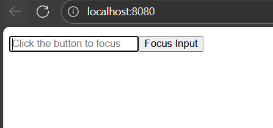

## 변경요약

Options API(data/computed/mounted/this) → Composition API + <script setup>

상태는 data() 대신 ref/reactive, 계산값은 computed(), 생명주기는 onMounted()

템플릿은 동일한 바인딩({{ }}, v-model) 유지. JS 코드에서만 ref는 .value 사용

Vue 3.2 환경이라 defineOptions는 미사용 → 컴포넌트명은 보조 <script>의 export default { name }로 지정

E12ReFComponent 동작 예시
